# Text Analyser

## What Text Analyser is :grey_question:

Text Analyser is lightweight library to analyse basic informations about text files like number of words, signs, spaces and empty lines.

## Getting started :rocket:

##

#### Requirements

To use this module you need to install latest version of Node on your computer.

##

#### Installation :sparkles:

##

```javascript
    npm install text-analyser
```

##

#### :boom: Ready to use! :smiley:

##

#### How to use :grey_question:

##

```javascript
import { analyse } from "text-analyser";

const pathToTxtFile = "txtFile.txt";

const informationsAboutTxtFile = analyse(pathToTxtFile);
```

##

##### That's all :sunglasses:

##

Variable **informationsAboutTxtFile** shoud look like this:

```javascript
    { signs: X, spaces: X, words: X, lines: X, emptyLines: X, notEmptyLines: X }
```

##

### UML Diagram

#### Sequence Diagram



##### Thank you for using this module. :blush:

##

## [Github Repository ](https://github.com/davidN96/text-analyser)
